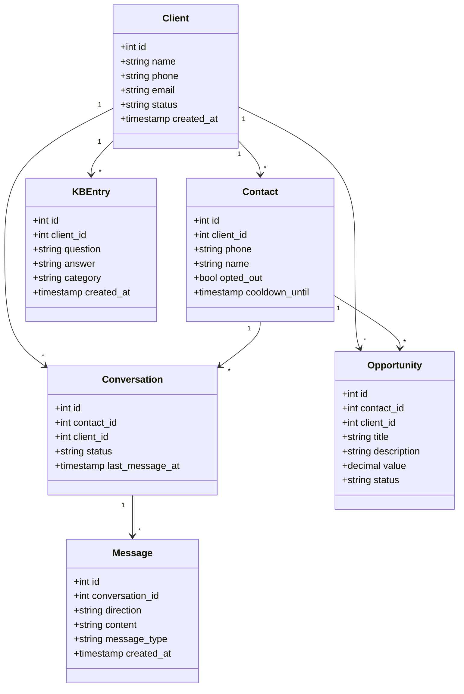
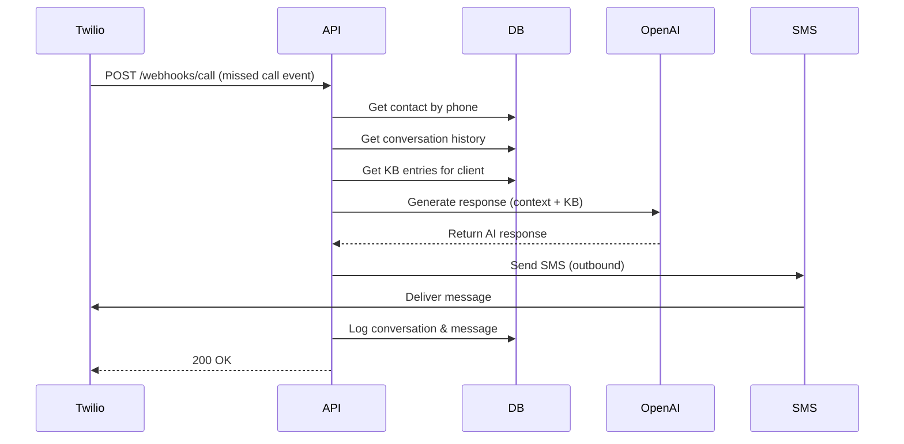
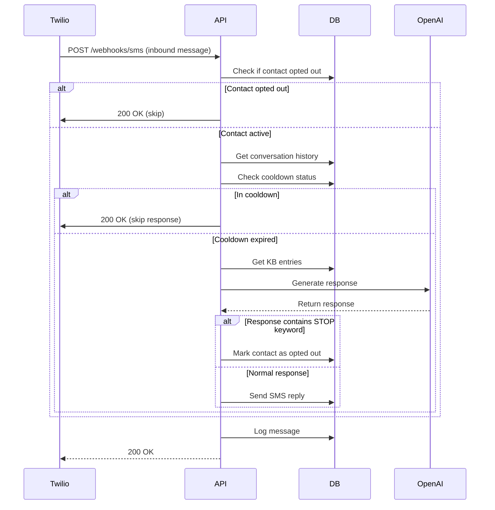
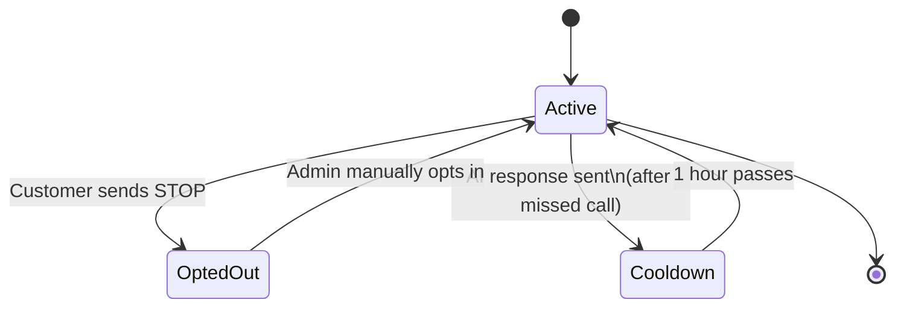
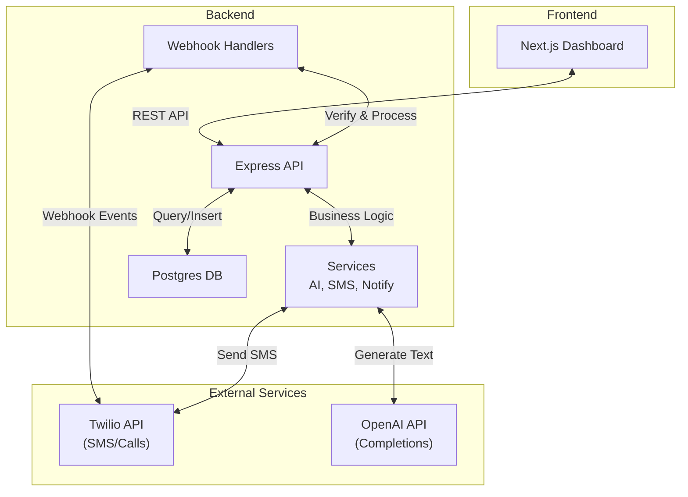
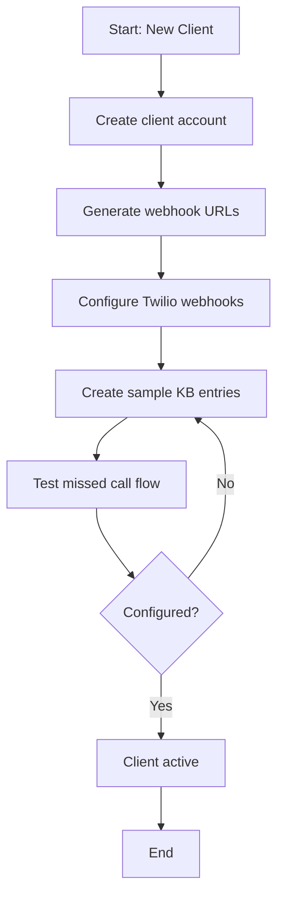

# UML Diagrams
## Reachback System Architecture

### 1. Use Case Diagram

```mermaid
actor Roofer
actor Customer
actor Admin

Roofer --> EditKB: Manage FAQ
Roofer --> ViewConversations: Review chats
Roofer --> ManageClients: Create account
Admin --> ManageClients
Admin --> ManageUsers

Customer --> ReceiveSMS: Get missed call response
Customer --> SendSMS: Reply to AI
Customer --> OptOut: Stop communications
```

### 2. Class Diagram



### 3. Sequence Diagram - Missed Call Handling



### 4. Sequence Diagram - Inbound SMS Handling



### 5. State Diagram - Contact Status



### 6. Component Diagram



### 7. Activity Diagram - Client Onboarding


